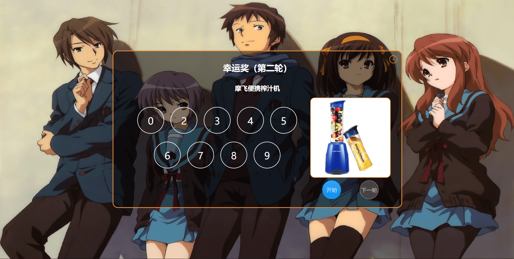
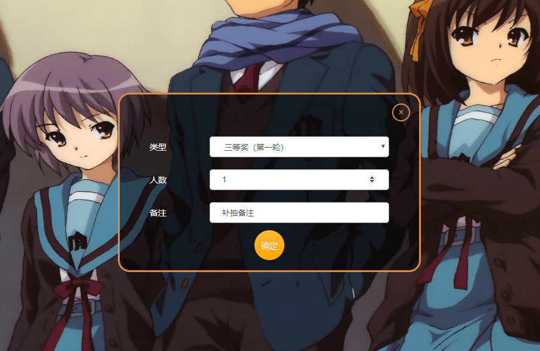
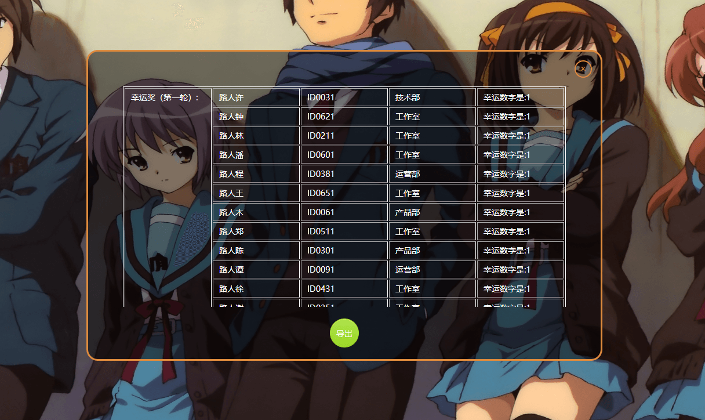

##抽奖

> 以前给公司做的抽奖项目，能自定抽奖类型（尾号或工号），自定抽奖项目轮次

####预先设置的奖项配置及抽奖规则:

| 项目 | 总数量 | 单次抽取数量 | 抽奖池 |
| ---| ---| ---| ---|
| 特等奖 | 1 | 1	| 员工工号 + 姓名
| 一等奖 | 10| 5| 员工工号 + 姓名	
| 二等奖 | 15| 5| 员工工号 + 姓名	
| 三等奖 | 30| 10| 员工工号 + 姓名	
| 幸运奖 | 2| 1| 0-9工号尾数	

> 幸运奖抽工号尾数，共两轮生成两个幸运尾数， 除了幸运奖以外，其他的抽奖每次抽完都会从被抽选人中剔除

1.点击抽奖可弹出抽奖页面，抽奖共十一轮，如表格所示；点击开始抽奖，停止结束抽动画，下一轮则跳到下一轮抽奖；

2.在特等奖之前会开启补抽功能，补抽的轮数和人数备注如下所示

1.点击抽奖可弹出抽奖页面，抽奖共十一轮，如表格所示；点击开始抽奖，停止结束抽动画，下一轮则跳到下一轮抽奖；

3.点击记录可以查看已抽中的人员名单，点击导出可导出excel文件到本地
1.点击抽奖可弹出抽奖页面，抽奖共十一轮，如表格所示；点击开始抽奖，停止结束抽动画，下一轮则跳到下一轮抽奖；

4.点击重置会重置所有的抽奖数据，由于抽奖数据是记录到本地的，所以要重置必须通过此按钮才能重置抽奖数据

1.点击抽奖可弹出抽奖页面，抽奖共十一轮，如表格所示；点击开始抽奖，停止结束抽动画，下一轮则跳到下一轮抽奖；

#### 代码review说明：
1.谷歌浏览器按F12，打开如图的调试界面，核心抽奖在Core.JS中

2.如果要核对每轮的抽奖结果，可以打开console界面，每轮的第一个数组表示被抽数组，第二个额表示抽取的结果，需要注意的是结果3并不表示抽中的是3，而是值被抽数组的下标数，所有的下标数都是从0开始，这里被抽对象刚好是正序的，所以3就是数组的第3个数字3；

3.人选抽选规则和数组是一样的，可以根据下标和被选数组一一对应下看有没有问题

4.随机数是调用第三方接口随机的，确保公平公正性，网站地址在这 https://api.random.org

#### 注意：
1.实际抽奖的停止按钮禁用时间时间长短可能会由于随机接口的返回快慢而波动；
2.项目存了17个接口key，每个接口每天调用次数为1000次，所以可能会出现停止按钮一直无法启用状态，刷新一下页面就行；
